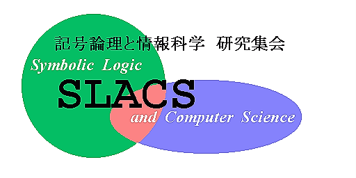

# 記号論理と情報科学 研究集会（SLACS） ホームページ

## SLACS とは

SLACS（スラックス）は，記号論理学と情報科学の境界領域に関する研究発表・研究討論の場を提供することを目的にして開催されている研究集会です．
1985年1月に第１回が開催されて以来，毎年１回のペースで開催されています．SLACS は，堅苦しい研究会ではなく，その年の幹事を中心とした参加者自らの手作りによるフレンドリーな雰囲気を持った集会です．気軽に発表できる場ですから，研究が進行中の話題を持ってきて議論したり，学生さんが発表する場としても適当です．もちろん，発展を続けるこの分野の最先端の研究テーマに関する発表も数多く聞くことができます．参加者の資格は問いませんので，原則として，どなたでも講演発表・聴講いただけます．発表はごく少数の例外を除いて日本語です．発表・参加希望および問合せは，その年の幹事あてにe-mailでお寄せください．

## 最近の SLACS のプログラム

* [SLACS2024](https://sites.google.com/view/slacs-2024/) (@東北大学, 幹事 浅田 和之 氏)
* [SLACS2023](https://lambda.ski/slacs2023/) (@京都橘大学+オンライン, 幹事 福田 陽介 氏)
* [SLACS2022](https://sites.google.com/view/slacs2022/) (@東邦大学+Zoom, 幹事 木村 大輔 氏)
* [SLACS2021](https://sites.google.com/view/slacs2021/) (@Zoom, 幹事 中村 誠希 氏)
* [SLACS2020](https://sites.google.com/view/slacs2020/) (@Zoom, 幹事 新屋 良磨 氏)
* [SLACS2019](https://sites.google.com/view/slacs-2019/) (@京都大学, 幹事 小島 健介 氏)
* [SLACS2018](https://sites.google.com/view/slacs-2018/) (@北海道大学, 幹事 佐野 勝彦 氏)
* [SLACS2017](2017/) (@千葉工業大学, 幹事 安部 達也 氏)
* [SLACS2016](http://www.st.nanzan-u.ac.jp/info/sasaki/2016slacs/SLACS2016.html) (@名古屋大学, 幹事 佐々木 克巳 氏)
* [SLACS2015](2015/) (@南山大学, 幹事 倉田 俊彦 氏)

## SLACS の歴史

* [SLACS という名前の由来](history/by-hayashi.html)
* [SLACS の歩み](history/)

----

## 関連する研究集会・メイリングリスト

### 研究集会

* [ALGI](https://sites.google.com/site/algimeeting/)（代数, 論理, 幾何と情報科学研究集会）
* MLG（数理論理学研究集会）

### メイリングリスト
* 「その手の」メイリングリスト: [説明](https://groups.google.com/g/sonoteno/about)
* logic-ml メイリングリスト および kisoron-ml メイリングリスト: [説明](https://www.fos.kuis.kyoto-u.ac.jp/mailman3)
